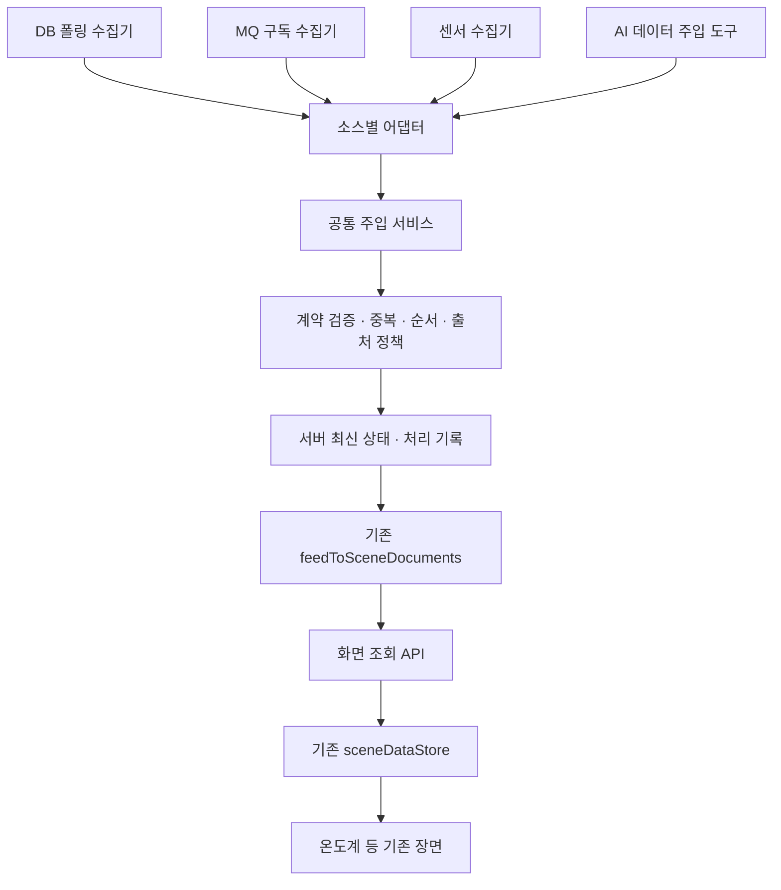

# DB·MQ·센서·AI 통합 FEED 설계서

- 작성일: 2026-09-11
- 상태: 검토용 초안. 구현 또는 배포 완료를 의미하지 않는다.
- 목적: 임시채팅에서 논의한 구조를 보존하고 기존 온도계 구현을 기준으로 다음 개발 범위를 정한다.
- 범위: 데이터 수집·주입·검증·화면 전달. 연출 디자인 변경과 화면 설정 명령 자체는 범위 밖이다.

## 1. 대화에서 정리한 요구

1. DB 조회, MQ 수신, 센서 수집, AI 추출·분석 결과가 같은 FEED 처리 경로를 사용할 수 있어야 한다.
2. DB 수집은 주기적으로 실행하고, MQ 수집은 연결·구독을 유지한다. 센서는 게이트웨이나 MQ를 거칠 수도 있다.
3. 수집 서비스는 화면의 열림·닫힘과 독립적으로 동작해야 한다.
4. 음성·텍스트로 AI에게 데이터 반영을 요청할 수 있어야 한다.
5. 이미 구현한 DB 기반 온도계를 출발점으로 확장한다. 온도계와 장면 저장소를 새로 만들지 않는다.

아래 세부 처리 규칙과 운영 구조는 이 요구를 구현하기 위한 제안이며 아직 구현 확정 사항은 아니다.

## 2. 용어와 기존 설계의 연결

- **원천**: DB, 설비, 센서, 문서 등 데이터가 생성되는 곳.
- **수신 수단**: SQL 조회, MQ 구독, HTTP 수신 등. 센서가 MQ로 전달될 수 있으므로 원천과 수신 수단을 구분한다.
- **FEED**: 정제된 도메인 데이터를 지속적으로 공급하는 흐름. 최종 정제 데이터는 FEED의 결과물이다.
- **장면 문서**: 도메인 FEED를 기존 장면 입력 계약으로 변환한 결과.
- **sceneDataStore**: 화면이 읽는 기존 장면 데이터 저장소. 서버의 영속 데이터 저장소와는 다르다.

기존 [소스 데이터 파이프라인 설계](2026-09-10-source-data-pipeline-design.md)는 소스→도착지→소비자 구조와 중간 계층 보류를 기록했다. 이 문서는 여러 입력 경로의 공통 검증·충돌 처리가 필요해진 시점의 후속 제안이다. 기존 문서를 덮어쓰거나 기존 결정을 자동으로 변경하지 않는다.

기존 [장면 데이터 계약](../standards/scene-data-contract.md)의 문서 봉투, 객체 자연키, 필드 서술자, 등록부를 재사용한다. 도메인 피드 선언은 계속 `domainFeeds.ts`를 단일 출처로 사용한다.

## 3. 현재 소스에서 확인한 구현

2026-09-11 작업 트리의 소스를 읽어 확인했다. 이번 문서 작성에서 실제 DB 접속이나 브라우저 동작은 재검증하지 않았다.

```text
브라우저 startFeedPolling
  → GET /api/cinema/feed
  → feedService.poll(): 갱신 주기가 지난 활성 피드 조회
  → runFeed / queryOracle
  → mapRowsToFeedData
  → feedToSceneDocuments
  → 브라우저 sceneDataStore.replace
  → 장면 렌더링
```

| 항목 | 확인 내용 |
|---|---|
| 환경 온습도 | `environment` 피드의 `zones`를 장면 문서로 변환하는 경로가 있다. |
| DB 조회 | `feedRunner.ts`가 설정된 SQL을 실행하고 매핑·장면 변환을 수행한다. |
| 주기 제어 | 현재는 HTTP 조회 요청 시 만료된 피드를 실행하는 방식이다. 화면과 독립된 상시 스케줄러는 이 경로에 없다. |
| 캐시 | 서버 프로세스 메모리에 결과를 보관하고 조회 실패 시 이전 정상 문서를 유지한다. 재시작 후 영속 복원과는 다르다. |
| 화면 저장소 | 장면 문서 검증과 객체 패치를 지원한다. 현재 갱신 우선순위는 도착 순서이며 `at`을 비교하지 않는다. |
| AI 값 변경 | `hatcheryTargets.ts`에 `source: hatchery` 객체 패치 경로가 있다. AI 입력 자체가 전혀 없는 상태는 아니다. |
| MQ·센서 상태 | `scannerConnectionStatus.ts`는 수신부 미구축 상태로 표시한다. |

따라서 다음 작업은 새 온도계 개발이 아니라 **기존 변환·장면 반영 경로 앞에 공통 수신 처리를 만들고 수집 실행을 화면 요청과 분리하는 것**이다.

## 4. 구조 선택

| 방식 | 장점 | 한계 |
|---|---|---|
| 소스별로 장면 저장소 직접 갱신 | 현재 구조에 가장 적은 변경 | 검증·충돌·AI 출처 처리가 소스별로 흩어짐 |
| **공통 주입 서비스로 통합** | 기존 계약을 재사용하며 수집 경로를 순차 추가 가능 | 서버 상태·영속 저장·수집 실행 책임을 정해야 함 |
| 모든 입력을 먼저 MQ로 통일 | 메시지 재처리·분산 소비를 중심으로 구성 가능 | DB 온도계 확장부터 브로커 운영이 필수가 됨 |

두 번째 방식을 제안한다. MQ는 지원할 입력 수단이며 모든 소스의 필수 경유지는 아니다.



공통 주입 서비스는 먼저 서버 내부 함수 경계로 만든다. 내부 DB 수집기가 자기 서버에 HTTP 요청을 보내야 할 필요는 없다. 외부 수집기용 주입 API와 AI 도구는 같은 서비스를 호출한다.

## 5. 책임과 계약

### 5.1 구성 요소

| 요소 | 책임 | 하지 않는 일 |
|---|---|---|
| 수집기 | DB 주기 실행, MQ 구독, 센서 연결 유지 | 그리기 코드 호출 |
| 어댑터 | 원본 필드 매핑, 단위·시각 변환 | 임의의 장면 상태 덮어쓰기 |
| 주입 서비스 | 스키마·대상 검증, 중복·출처 충돌 처리 | 원본 DB에 측정값 쓰기 |
| 서버 상태 저장 | 승인된 최신값·수정번호·처리 결과 보관 | 브라우저 세션에 수집 책임 위임 |
| 장면 변환 | 공통 FEED를 기존 장면 문서로 변환 | DB·MQ 직접 접근 |
| 화면 어댑터 | 최신 문서 수신 후 기존 저장소에 반영 | 소스별 수집 로직 실행 |

### 5.2 주입 요청 제안

기존 도메인 피드 봉투 `{ feed, version, source, at, data }`를 재사용하되 공통 수신용 메타데이터를 별도로 둔다. 아래 명칭은 신규 계약 제안이며 현재 API에서 지원한다는 뜻은 아니다.

| 필드 | 의미 |
|---|---|
| `eventId` | 재시도에도 유지되는 수신 식별자. 객체 자연키와 구분한다. |
| `feed` | 기존 도메인 피드 ID. 첫 대상은 `environment`. |
| `sourceId` / `originKind` / `transport` | 등록 원천, 실제 생성 원천 종류, DB·MQ 등의 전달 수단. |
| `observedAt` / `receivedAt` | 측정·생성 시각과 서버 수신 시각. 수신 시각은 서버가 기록한다. |
| `quality` | 실측·추정·분석·수동 입력 구분. AI가 전달한 실측값과 AI가 추정한 값도 구분한다. |
| `operation` | `snapshot` 전체 교체 또는 `patch` 부분 갱신. |
| `payload` | 기존 필드 서술자와 도메인 계약에 맞는 값·단위·객체 ID. |
| `evidence` | AI 추출·분석에 사용한 문서나 원본 이벤트 참조. |

기존 장면 `source` 값은 `mes / push / hatchery / static / demo`다. 여기에 임의로 `mq`·`sensor`·`ai`를 넣으면 현재 검증에 맞지 않는다. 상세 출처는 서버 메타데이터에 보존하고 장면 전달 시 기존 값으로 매핑한다. 필드별 출처를 화면에 표시해야 할 때만 표시 계약을 명시적으로 확장한다.

### 5.3 데이터 충돌 규칙 제안

1. 등록된 피드·객체·필드만 수신하며 단위와 범위는 기존 서술자에서 검증한다.
2. `(sourceId, eventId)`가 같고 내용도 같으면 이미 처리한 결과를 반환한다. 같은 ID에 다른 내용이 오면 충돌로 거부한다.
3. 같은 원천·객체·필드의 이전 측정값이 늦게 도착하면 최신값을 되돌리지 않는다. 신뢰할 수 있는 원천 순번이 있으면 순번을 사용한다. 시각만으로 순서를 결정할 수 없는 동률·누락은 경고와 정해진 정책으로 처리한다.
4. DB와 센서가 같은 온도를 공급하면 피드·객체·필드별 권위 원천을 설정한다. 마지막 도착자가 무조건 이기는 방식으로 병합하지 않는다.
5. 전체 교체는 해당 원천에 지정된 범위만 교체한다. 다른 원천의 객체나 분석값을 지우지 않는다. 첫 환경 피드는 전체 교체 담당 원천을 하나로 제한한다.
6. 객체 추가·삭제는 기존 계약처럼 전체 교체로만 허용한다. 패치는 존재하는 객체의 허용 필드만 수정한다.
7. AI 추정·분석값은 실측값과 별도 상태로 저장한다. 초기 화면에 표현할 계약이 없는 분석 결과는 실측 필드에 억지로 넣지 않고 지원 대상 밖으로 보고한다.
8. 검증 실패 시 이전 정상값을 유지하되 최신 정상 상태로 표시하지 않는다.

주입 결과는 `accepted / duplicate / rejected`와 사유·수정번호를 반환한다. 서버 저장 성공과 사용자의 화면 반영 성공은 구분한다.

## 6. DB·MQ·센서·AI 실행 방식

### DB

- 기존 SQL 설정·매핑·`queryOracle`를 재사용한다.
- 독립 수집 실행기가 활성 피드의 주기를 관리한다. 같은 피드는 이전 조회 완료 전 다시 실행하지 않는다.
- 초기 운영은 단일 수집 실행기를 전제로 한다. 복수 프로세스 운영 시 피드 실행 소유권 또는 분산 잠금이 필요하다.
- 화면 GET 요청은 저장된 최신 결과를 읽는다. 전환 시 기존 요청 기반 DB 실행을 함께 끄고 중복 수집을 방지한다.

### MQ·센서

- MQ는 선택한 브로커의 구독·소비 방식을 사용하고 연결 끊김을 감지해 재연결한다.
- 확인 응답을 지원하는 MQ에서는 영속 반영 후 처리 완료를 알린다. 재전달은 공통 중복 처리로 흡수한다.
- 형식 오류는 원인 기록과 격리 정책을 적용하고 무한 재시도하지 않는다. 일시적 통신 장애는 제한된 재시도와 대기를 적용한다.
- 센서는 장치 ID·단위·측정 시각을 확보하는 어댑터를 둔다. 센서→MQ 경로에서는 같은 측정을 별도 원천으로 중복 집계하지 않는다.
- 브로커 제품, 프로토콜, 구독명은 실제 연결 대상 확인 후 정한다.

### AI

- 기존 장면 값 변경 도구를 폐기하지 않는다. 공유 데이터로 반영할 요청은 같은 주입 서비스로 연결한다.
- 음성·텍스트가 동일한 데이터 주입 도구와 검증을 사용한다.
- 도구는 허용된 피드·필드·원천 권한만 사용한다. 문서에서 나온 명령문을 실행 지시로 취급하지 않는다.
- 자료에 없는 값을 실제 측정값으로 생성하지 않는다. 추출·추정·사용자 수동 입력의 성격과 근거를 기록한다.
- 원본 MES DB 수정은 FEED 주입 범위에 포함하지 않는다.
- 메뉴 열기·연출 설정은 기존 화면 제어 도구에 둔다. 수집 주기나 원천 설정 변경은 별도 설정 명령으로 분리한다.

## 7. 저장·화면 전달·운영 상태

- 서버에는 최신값과 수신 처리 기록을 영속 저장한다. 중복 식별 기록·수정번호와 최신 상태는 함께 일관되게 반영해야 한다.
- 브라우저 `sceneDataStore`는 표시용 저장소로 유지한다. 서버 재시작 복원 책임을 맡기지 않는다.
- 첫 단계 화면 전달은 기존 폴링을 유지한다. 상시 수집과 화면 푸시는 별개 결정이다. SSE 등 푸시는 이후 필요가 확인되면 추가한다.
- 조회 응답에 서버 수정번호를 두고 브라우저는 이미 적용했거나 더 오래된 응답으로 상태를 되돌리지 않는다.
- DB·MQ·센서 상태는 각 수집 경로의 연결과 마지막 성공을 표시한다. FEED 상태는 검증·변환·저장 결과와 최신성을 표시한다. 화면 반영 거부는 별도로 보고한다.
- 실패해 남아 있는 마지막 정상값에는 마지막 성공 시각과 지연 상태를 유지한다.
- 항상 켜진 수집 프로세스와 영속 저장 위치가 운영 환경에 필요하다. 정적 페이지 단독으로는 이를 실행할 수 없다. 현재 배포 상태 확인 없이 운영 완료로 간주하지 않는다.
- 외부 주입 API를 공개할 때는 원천 인증과 쓰기 범위를 검사한다. 현재 로컬 요청 제한을 단순히 해제하는 방식으로 확장하지 않는다.

## 8. 단계별 구현과 완료 기준

### 1단계 — 기존 온도계 경로를 공통 주입 경계로 연결

- `environment` 피드만 첫 대상으로 삼는다.
- 기존 DB 매핑 결과를 공통 검증·주입 함수에 전달하고 기존 장면 변환을 재사용한다.
- 전체 피드 이관이나 UI 재설계는 하지 않는다.
- 완료 기준: 동일한 DB 입력에 기존과 같은 온도계 데이터가 생성되고 잘못된 값은 거부된다. 조회 실패 시 이전 정상값과 실패 상태가 보존된다.

### 2단계 — 수집 실행과 화면 요청 분리

- 환경 피드 독립 실행, 영속 최신 상태·중복 기록, 읽기 전용 조회 경로를 연결한다.
- 완료 기준: 화면을 닫아도 갱신되고, 두 화면을 열어도 수집 횟수가 늘지 않으며, 재시작 후 마지막 상태가 복원된다.
- 전환 시 한 피드를 기존 실행 또는 새 실행 중 한쪽에서만 소유하도록 한다. 복귀 시에도 같은 원칙을 적용한다.

### 3단계 — 두 번째 입력 경로 검증

- 실제 사용 가능한 MQ 또는 센서 경로 하나를 선택해 환경 피드에 연결한다.
- 완료 기준: 온도계 그리기 코드를 바꾸지 않고 원천 설정을 변경할 수 있다. 재연결·중복·역순 수신·원천 충돌이 정해진 정책대로 처리된다.

### 4단계 — AI 데이터 주입 통합

- 기존 AI 값 변경과 새 문서 추출 입력의 공유 반영 경로를 연결한다.
- 완료 기준: 음성·텍스트가 같은 처리 결과를 받고, 반영 결과를 재조회할 수 있으며, 실측값을 AI 추정값이 덮어쓰지 않는다.
- 예시: 실제 등록 구역 ID를 대상으로 문서에서 추출한 온도를 검증하고 출처와 함께 반영한다. 테스트용 원천만으로 실제 연결 완료를 선언하지 않는다.

## 9. 변경 영향 지도

| 파일 또는 영역 | 사용·변경 방향 |
|---|---|
| `src/cinema/domainFeeds.ts`, `sceneFields.ts` | 기존 피드·필드 계약 재사용. 새 필드는 필요한 경우에만 추가 |
| `src/cinema/feedMapping.ts` | DB 컬럼 매핑 재사용 |
| `src/server/cinema/feedRunner.ts` | SQL 실행·변환과 요청 기반 실행 책임 분리 |
| `src/server/cinema/oracleSource.ts` | 기존 조회 경로 재사용 |
| `src/server/cinema/` 신규 모듈 | 주입 서비스·수집 실행·서버 저장 책임을 각각 분리 |
| `src/app/api/cinema/feed/route.ts` | 장기적으로 저장 결과 조회만 담당 |
| `src/cinema/feedScenes.ts` | 기존 도메인→장면 변환 재사용 |
| `src/cinema/feedPolling.ts` | 기존 폴링 유지, 필요 시 수정번호 비교 추가 |
| `src/cinema/sceneDataStore.ts`, `sceneDataRegistry.ts` | 기존 표시·검증 경계 보존, 서버 저장소로 오인하지 않음 |
| `src/cinema/hatcheryTargets.ts`, AI 도구 연결부 | 화면 로컬 패치와 서버 공유 반영 범위 구분 |
| `src/cinema/scannerConnectionStatus.ts` | 실제 수집·주입 상태 근거 연결 |
| `tests/unit/scenes/cinemaFeedModel.test.ts`, `cinemaFeedServer.test.ts`, `cinemaFeedPolling.test.ts` | 기존 회귀 검증 재사용, 중복·역순·실패 보존 검증 추가 |

환경 장면 입력이 동일하게 유지되는 범위에서는 온도계 그리기 코드를 변경하지 않는다. 출처·추정 표시를 새로 제공할 경우에는 그 표시 범위만 별도로 설계한다.

## 10. 다음 구현 전에 정할 사항

1. 상시 수집 실행 환경과 서버 영속 저장소. 기존 운영 구성을 확인한 뒤 선택한다.
2. 첫 온도계 피드의 실제 구역 ID, 매핑, 주기, 측정 시각 컬럼. 비밀 접속값이나 원본 행은 이 문서에 기록하지 않는다.
3. DB·센서가 같은 필드를 공급할 때 권위 원천과 장애 시 전환 정책.
4. AI 값 변경의 기본 범위: 개인 화면 임시 변경인지, 공유 FEED 수동 입력인지. 공유 반영에는 출처와 사용자 권한을 남긴다.
5. 첫 MQ·센서 연결 대상과 실제 프로토콜.

문서에 적힌 기본 방향만으로 새로운 서버·포트·브로커를 임의로 설치하거나 변경하지 않는다.

## 11. 이어서 작업할 때

다음 요청으로 재개할 수 있다.

> `docs/specs/2026-09-11-unified-feed-ingestion-design.md`를 읽고 기존 DB 온도계의 실제 데이터 경로를 다시 확인해. 1단계인 환경 피드 공통 주입 경계만 구현해. 기존 장면 계약과 현재 작업 트리를 보존하고, 문서의 미결 사항 중 해당 단계에 필요한 것만 먼저 확인해.

이 문서 작성에서는 문서 파일 하나만 추가했다. 애플리케이션 코드, 실행 프로세스, DB 설정, Git 커밋·푸시를 변경하지 않았다. 빌드나 런타임 검증을 수행한 것으로 간주하지 않는다.
